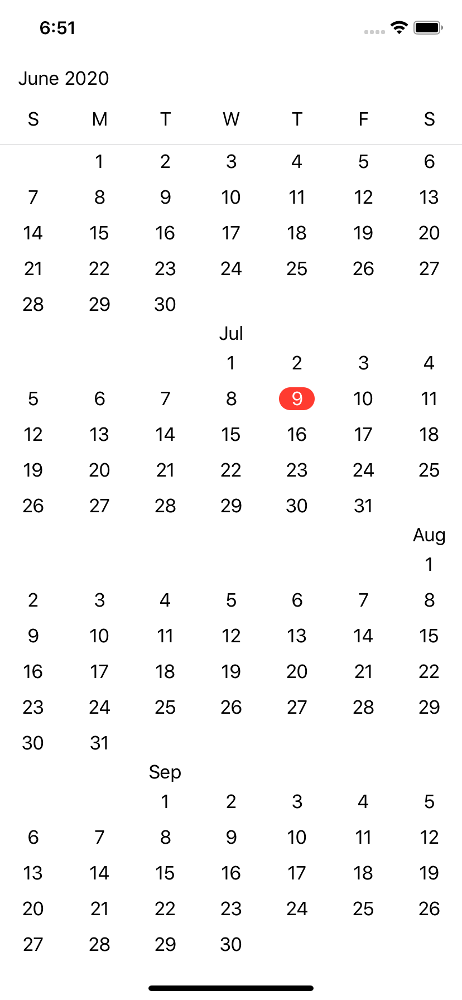
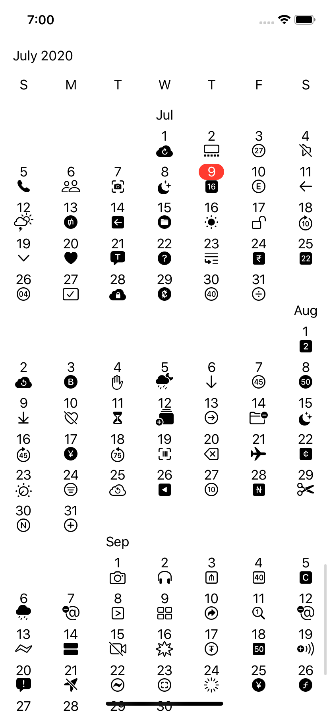
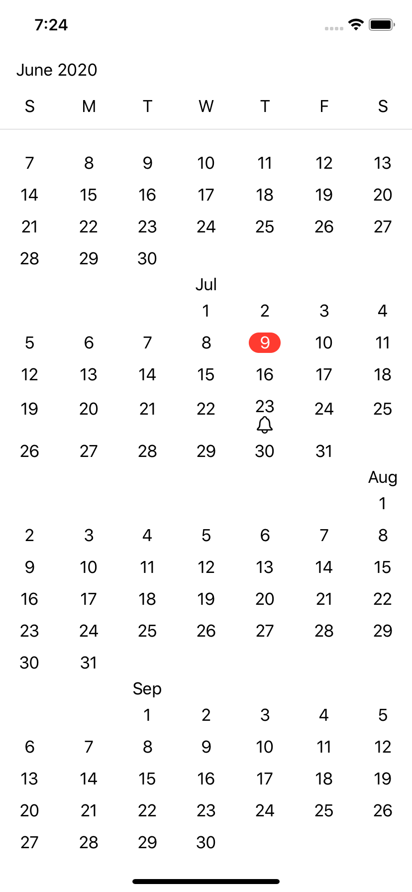

# KalendarView

Fast and extensible Calendar View made with Swift UI.

Inspired by https://github.com/RaffiKian/RKCalendar

# Screenshots

## A simple calendar

## A calendar with SF Symbols as accessory for each day

## A calendar with a symbol for a predefined day

